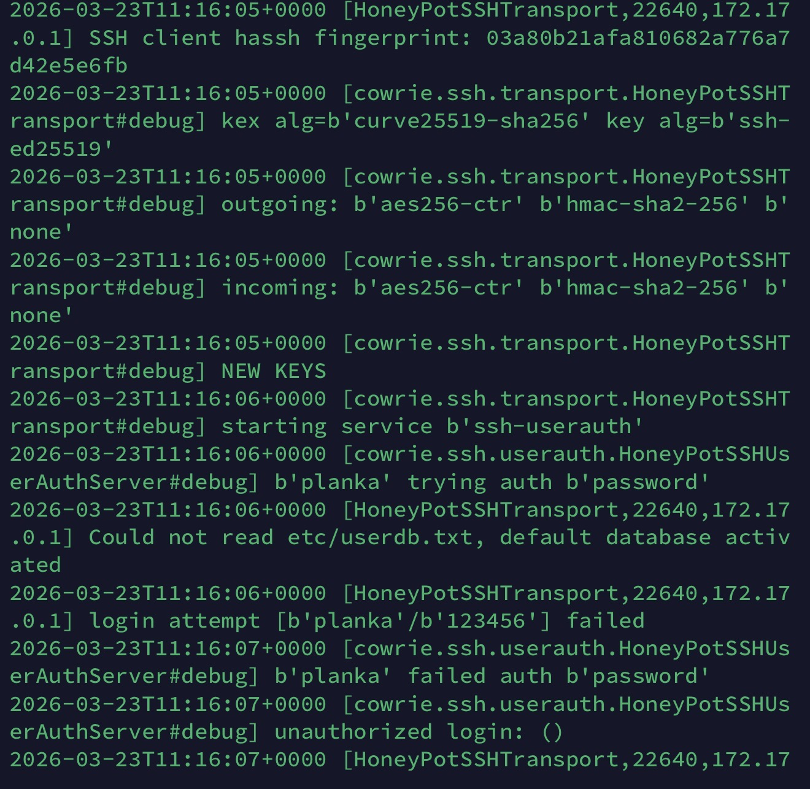
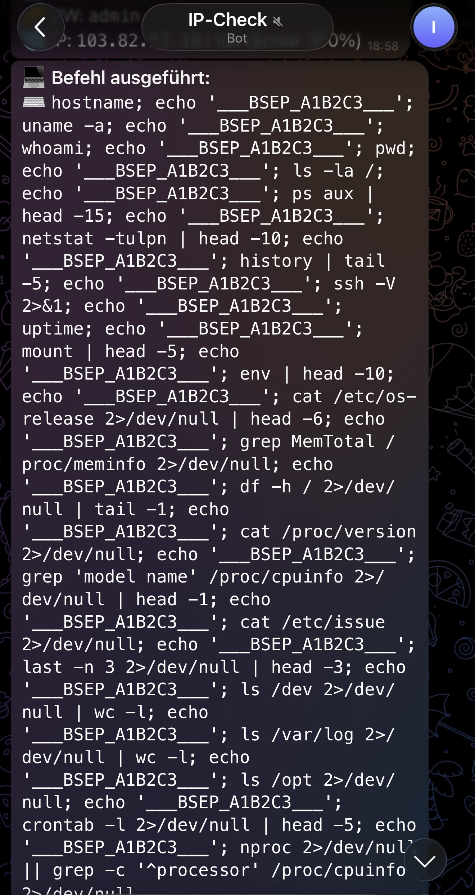
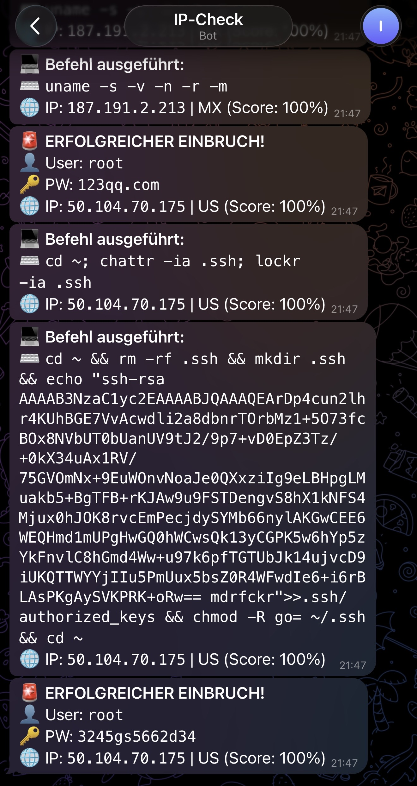
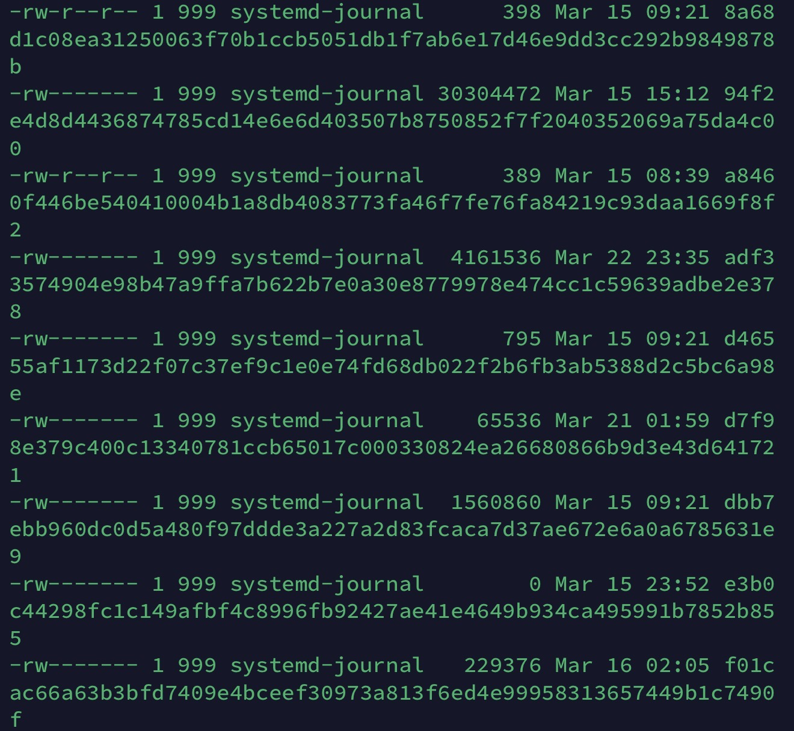
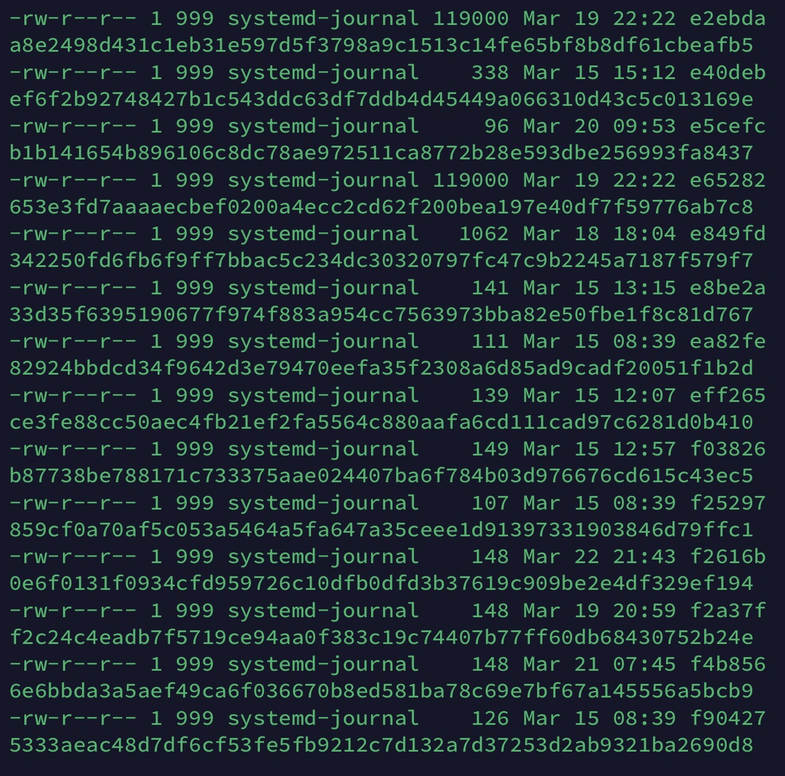
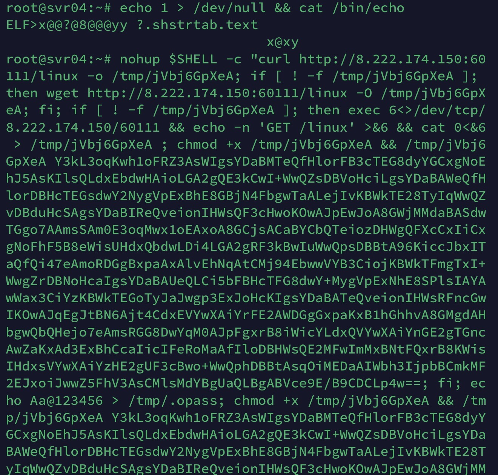
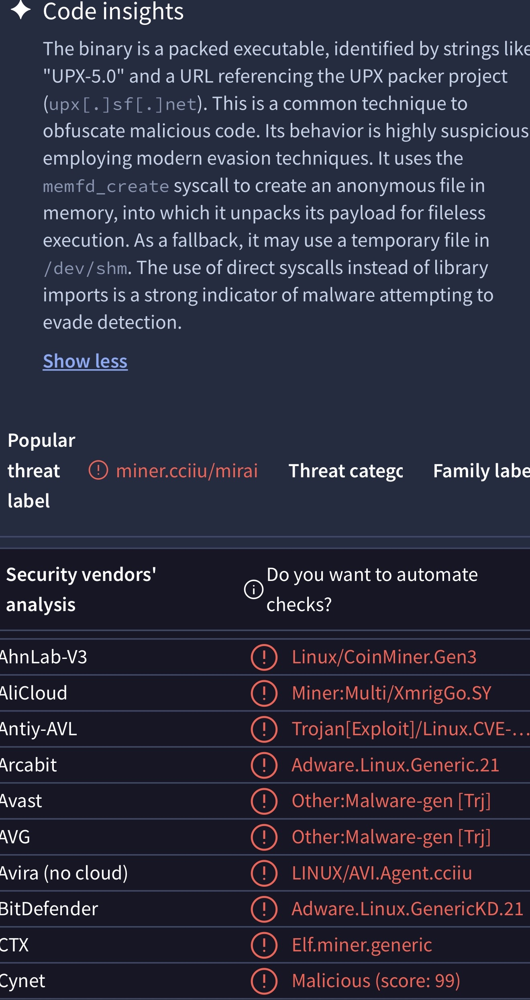

# 🍯 Cowrie SSH Honeypot — Production Deployment & Threat Intelligence

> A fully operational SSH honeypot running on a public-facing Hetzner VPS, capturing real-world attack campaigns, malware samples, and attacker TTY sessions — with automated Telegram alerting, AbuseIPDB reporting, and a custom clustering engine that links sessions into named campaigns.

---

## 🆕 What's New

**Inspector Gadget** ([`inspector_gadget/`](inspector_gadget/)) — a second-generation analysis daemon that clusters tens of thousands of honeypot sessions into named attack campaigns using a two-layer BFS model. Provides an interactive Telegram bot for seeding clusters, generating reports, and discovering new campaigns.

The original `analyze_cowrie.py` has been upgraded to integrate with Inspector Gadget: sessions belonging to known clusters are now suppressed at the alert layer, so the Telegram channel surfaces only new or unclustered activity. The VirusTotal API is also queried for every download for automatic malware classification.

The previous version of the alert script is preserved under [`scripts/legacy/`](scripts/legacy/) for reference.

---

## 📋 Table of Contents

- [Overview](#overview)
- [Infrastructure](#infrastructure)
- [Live Honeypot Activity](#live-honeypot-activity)
- [Telegram Alert Bot](#telegram-alert-bot)
- [Threat Campaign: mdrfckr Botnet](#threat-campaign-mdrfckr-botnet)
- [Captured Malware & Downloads](#captured-malware--downloads)
- [Malware Analysis: VirusTotal](#malware-analysis-virustotal)
- [Inspector Gadget — Analysis & Clustering Engine](#inspector-gadget--analysis--clustering-engine)
- [IOC List](#ioc-list)
- [Setup](#setup)
- [Repository Structure](#repository-structure)

---

## Overview

This project documents a **production SSH honeypot** deployed on a real public IP, not a local lab. It captures live attack traffic from automated botnets and manual intrusion attempts worldwide.

**Goals:**
- Capture attacker TTY sessions and command sequences
- Collect and analyze dropped malware samples
- Identify and document recurring threat campaigns
- Automate real-time alerting with IP reputation enrichment
- Cluster historical sessions into named campaigns for longitudinal analysis

**Stack:** Cowrie · Python · SQLite · Telegram Bot API · AbuseIPDB · VirusTotal · Hetzner VPS · Ubuntu 24.04

---

## Infrastructure

| Component | Details |
|---|---|
| **VPS Provider** | Hetzner Cloud |
| **OS** | Ubuntu 24.04 LTS |
| **RAM** | 4 GB |
| **Cowrie Mode** | Native (non-Docker) |
| **Honeypot Port** | 22 (redirected via iptables) |
| **Real SSH Port** | Custom, bound to WireGuard interface only |
| **Additional Services** | Portainer, Nginx Proxy Manager, Uptime Kuma, Fail2Ban |

Cowrie runs natively on the host (migrated from Docker) for better log access and process isolation. Real SSH traffic is separated via `iptables` port redirection, and the administrative SSH port is hidden behind a WireGuard VPN — so the honeypot can advertise port 22 publicly while the real management plane is unreachable from the open internet.

---

## Live Honeypot Activity

The following screenshot shows Cowrie's debug output during a live attack session — including the SSH key exchange (`curve25519-sha256`), cipher negotiation (`aes256-ctr`), and a failed login attempt with username `planka` / password `123456`.


*Real-time Cowrie log output: SSH handshake, key exchange, and failed authentication attempt captured live.*

This level of detail allows reconstruction of exactly what an attacker's client sent — including which SSH algorithms they support, which can be used for attacker fingerprinting.

---

## Telegram Alert Bot

All honeypot events are forwarded in real-time to a private Telegram channel via [`scripts/analyze_cowrie.py`](scripts/analyze_cowrie.py). The bot enriches each event with:

- **AbuseIPDB score** — reputation check per attacker IP (cached on disk, configurable suppression threshold)
- **VirusTotal lookup** — automatic hash check on every captured download
- **Country flag** — geolocation
- **Inspector Gadget filter** — sessions belonging to known clusters are suppressed

### System Reconnaissance

This screenshot shows an attacker running a full automated recon script immediately after gaining access — collecting hostname, OS version, CPU info, memory, running processes, open ports, cron jobs, and more in a single command chain using `___BSEP_A1B2C3___` as a delimiter to parse output programmatically.


*Automated post-exploitation recon script captured via Telegram alert — attacker systematically enumerating the system.*

This is consistent with an automated exploitation framework, not manual hacking.

---

## Threat Campaign: mdrfckr Botnet

One of the most significant findings was a **recurring botnet campaign** identified by its SSH key fingerprint `mdrfckr`. The same key was observed across multiple IPs in France 🇫🇷, China 🇨🇳, and South Korea 🇰🇷 — strongly suggesting a coordinated botnet with persistent infrastructure.

### What the Attacker Did

After authentication, the attacker immediately:
1. Cleared the `.ssh` directory
2. Injected their own SSH public key into `authorized_keys` (persistence)
3. Set restrictive permissions to lock out the legitimate owner
4. Attempted further credential-based attacks from the same IP


*Telegram alert showing the mdrfckr SSH key being written to `authorized_keys` — classic persistence mechanism. Note the AbuseIPDB score of 100% for all involved IPs.*

The key comment `mdrfckr` in the public key string allowed correlation across multiple sessions and IPs, turning a single event into a trackable campaign. Inspector Gadget has since formalized this into a cluster (`command_text = mdrfckr`) containing ~7,500 sessions.

---

## Captured Malware & Downloads

Cowrie's download capture feature saved all files that attackers attempted to fetch or execute. The files were stored with their SHA256 hashes as filenames — a common convention for malware repositories.


*Cowrie download directory — captured binaries stored by SHA256 hash. Note file sizes ranging from small stagers (96 bytes) to full payloads (30+ MB).*

Cowrie also records every attacker TTY session as a separate file, allowing full reconstruction of what was typed and executed.


*Cowrie TTY session directory — each file represents a complete recorded attacker session, stored for forensic replay.*

### Attacker Dropper Command

The following TTY session shows the full malware deployment command captured by Cowrie. The attacker uses a multi-fallback download chain (`curl` → `wget` → raw TCP socket via `/dev/tcp`) to fetch a binary from `8.222.174.150:60111`, then executes it with a base64-encoded payload argument.


*Full attacker TTY session: multi-stage dropper using curl/wget/dev/tcp fallback chain, followed by execution with a large base64-encoded payload — consistent with XMRig miner deployment.*

**Observed TTY techniques:**
- `curl` with fallback to `wget` and raw `/dev/tcp` socket
- Binary dropped to `/tmp/` with random filename
- `chmod +x` followed by immediate execution
- Base64-encoded configuration blob passed as argument (XMRig pool config)
- Credential written to `/tmp/.opass`

---

## Malware Analysis: VirusTotal

Captured samples were submitted to VirusTotal for static analysis. The primary sample was identified as a **UPX-packed ELF binary** with advanced evasion techniques.


*VirusTotal analysis of captured binary — classified as `miner.cciiu/mirai` by multiple vendors. Cynet: Malicious (score 99). Uses `memfd_create` for fileless execution.*

**Key findings:**
| Property | Value |
|---|---|
| **Packer** | UPX 5.0 |
| **Family** | miner.cciiu / Mirai variant |
| **Execution** | Fileless via `memfd_create` syscall |
| **Fallback** | `/dev/shm` temporary file |
| **Evasion** | Direct syscalls instead of library imports |
| **AhnLab** | Linux/CoinMiner.Gen3 |
| **AliCloud** | Miner:Multi/XmrigGo.SY |
| **Cynet Score** | 99/100 (Malicious) |

The use of `memfd_create` to unpack and execute the payload entirely in memory — with no file written to disk — represents a sophisticated evasion technique commonly seen in advanced Linux malware.

VirusTotal lookups are now automated: every SHA256 captured in a Cowrie download event is checked automatically by `analyze_cowrie.py`, and the detection ratio + threat classification is included in the Telegram alert.

---

## Inspector Gadget — Analysis & Clustering Engine

After months of honeypot operation, the alert-per-session model reached its limits. A single botnet generating 500 sessions produced 500 independent Telegram messages. There was no way to ask *"show me every session where the attacker used the `mdrfckr` SSH key across the full log history."*

**Inspector Gadget** ([`inspector_gadget/`](inspector_gadget/)) is a dedicated long-running daemon that solves this. It ingests Cowrie JSON logs into a normalized SQLite DB, then lets the operator define **attack campaigns** as clusters of sessions linked by shared strong indicators.

### Two-Layer Clustering

- **Layer 1 — Direct seed match.** The operator provides a seed (e.g. `command_text = "mdrfckr"`). All sessions containing that indicator become the cluster's initial membership.
- **Layer 2 — BFS expansion.** For each seed session, sessions sharing a strong indicator — SSH key fingerprint, download SHA256, or command-sequence hash — are pulled into the cluster. Each new session becomes a new frontier node, and the search continues until no new sessions match.

**Deliberately excluded from BFS:** passwords (too many campaigns share common passwords) and source IPs (attackers rotate them constantly). Letting BFS follow either would cause mega-cluster contamination where unrelated campaigns merge.

### Current Clusters

| Cluster | Sessions | Primary Seed | Notes |
|---|---|---|---|
| **mdrfckr** | ~7.5k | `command_text = mdrfckr` | SSH key persistence botnet |
| **6F6B** | ~37.8k | `command_text = \x6F\x6B` | Massive brute-forcer, only 2 source IPs, ~25k unique passwords |

### Integration with Live Alerting

The live alert script `analyze_cowrie.py` queries the Inspector Gadget DB on every session. If the attacker's IP, password, or any command matches a known cluster, the alert is suppressed — so the Telegram channel only surfaces genuinely new or unclustered activity. This cut alert volume by over 90%.

### Architecture Summary

Seven modules, single systemd service:

```
main.py        entry point, async event loop
config.py      env-driven configuration
database.py    SQLite schema and CRUD
ingester.py    Cowrie log reader, handles rotation + resume
analyser.py    seeding and two-layer BFS clustering
reporter.py    formatted cluster reports with pagination
bot.py         Telegram command handlers + scheduled weekly report
```

See [`inspector_gadget/README.md`](inspector_gadget/README.md) for the full command reference, setup instructions, and module breakdown.

---

## IOC List

Indicators of Compromise collected during operation:

### SSH Key Fingerprints
| Fingerprint | Campaign |
|---|---|
| `mdrfckr` (key comment) | mdrfckr botnet persistence |

### Malicious IPs (AbuseIPDB Score 100%)
| IP | Country | Activity |
|---|---|---|
| `50.104.70.175` | 🇺🇸 US | mdrfckr key injection, credential brute-force |
| `187.191.2.213` | 🇲🇽 MX | Post-auth command execution |
| `8.222.174.150` | 🇨🇳 CN | Malware C2 / payload host |

### Malware Hashes (SHA256)
> See `/downloads/` directory in Cowrie data path for full sample collection.

---

## Setup

### Cowrie + Live Alerts

```bash
# Clone and install Cowrie
git clone https://github.com/MircoSchroeder/Cowrie-Honeypot
cd Cowrie-Honeypot
chmod +x scripts/setup_cowrie.sh
sudo bash scripts/setup_cowrie.sh

# Configure the alert bot
cp scripts/analyze_cowrie.example.env scripts/analyze_cowrie.env
nano scripts/analyze_cowrie.env   # fill in Telegram, AbuseIPDB, VirusTotal keys

# Run the alert bot
set -a && source scripts/analyze_cowrie.env && set +a
python3 scripts/analyze_cowrie.py
```

**iptables redirect (port 22 → Cowrie's 2222):**
```bash
sudo iptables -t nat -A PREROUTING -p tcp --dport 22 -j REDIRECT --to-port 2222
sudo iptables-save > /etc/iptables/rules.v4
```

### Inspector Gadget Daemon

See [`inspector_gadget/README.md`](inspector_gadget/README.md) for full setup. Short version:

```bash
sudo cp -r inspector_gadget /opt/inspector_gadget
cd /opt/inspector_gadget
sudo pip3 install -r requirements.txt --break-system-packages
sudo cp .env.example .env && sudo nano .env
sudo cp inspector_gadget.service /etc/systemd/system/
sudo systemctl daemon-reload
sudo systemctl enable --now inspector_gadget
```

---

## Repository Structure

```
Cowrie-Honeypot/
├── README.md                            # This file
├── screenshots/
│   ├── cowrie_live_log.jpg              # Live Cowrie debug output
│   ├── cowrie_downloads_1.jpg           # Captured malware samples
│   ├── cowrie_tty_session.jpg           # Full attacker TTY session
│   ├── tty_directory.jpg                # TTY session directory
│   ├── telegram_commands.jpg            # Telegram alert: recon commands
│   ├── telegram_mdrfckr.jpg             # Telegram alert: mdrfckr campaign
│   └── virustotal.jpg                   # VirusTotal malware analysis
├── scripts/
│   ├── setup_cowrie.sh                  # Automated Cowrie installation
│   ├── analyze_cowrie.py                # Live Telegram alert bot (v2, IG-integrated)
│   ├── analyze_cowrie.example.env       # Config template
│   └── legacy/
│       └── analyze_cowrie.py            # v1 of the alert bot, kept for reference
└── inspector_gadget/                    # Clustering & analysis daemon
    ├── README.md                        # Full module documentation
    ├── main.py                          # Entry point
    ├── config.py                        # Env-driven config
    ├── database.py                      # SQLite layer
    ├── ingester.py                      # Log reader
    ├── analyser.py                      # Clustering engine
    ├── reporter.py                      # Report formatters
    ├── bot.py                           # Telegram commands
    ├── requirements.txt                 # python-telegram-bot
    ├── inspector_gadget.service         # systemd unit
    └── .env.example                     # Config template
```

---

## Skills Demonstrated

- **SSH Honeypot Deployment** — Production VPS, iptables redirection, native Cowrie, WireGuard-isolated admin plane
- **Threat Intelligence** — Campaign correlation via SSH key fingerprinting, command-sequence hashing, two-layer BFS clustering
- **Malware Analysis** — Static analysis with VirusTotal, identifying UPX packing, fileless execution via `memfd_create`, miner families
- **Python Automation** — Long-running daemons, async Telegram bots, SQLite schema design, real-time log parsing
- **Linux Administration** — systemd service management, iptables, log rotation handling, process isolation, systemd hardening (`ProtectSystem`, `NoNewPrivileges`)
- **Data Engineering** — Normalized schema for session/command/credential/download/key data, read-position tracking across rotated log files
- **Incident Documentation** — IOC extraction, TTY session analysis, dropper command reconstruction, campaign attribution

---

*All data collected on infrastructure I own and operate. Attacker IPs have been reported to AbuseIPDB.*
